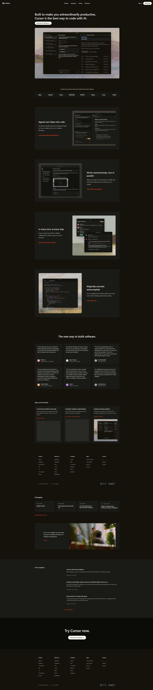

# Dev Tool Landing Page - Cursor Clone

This repository contains a desktop-first developer tool landing page, cloned and inspired by the [Cursor website](https://cursor.com/). This project was built for the Web Dev Cohort 2026 assignment.

## 📸 Final Output Preview

## 🎯 Goal & Constraints

The primary objective of this project was to achieve maximum **visual and structural accuracy** compared to the original design, adhering strictly to the following constraints:
- Built strictly with **HTML and CSS**
- **No JavaScript** functionality
- **No TailwindCSS** or external UI frameworks
- **No usage of AI** generated code snippets
- Focused solely on a static, **desktop-only** layout (no extreme responsiveness required)
- No interactive animations or fancy CSS effects

## 🛠️ Sections Recreated

The clone includes the following 11 completed sections, structured symmetrically to match the reference materials:

1. **Top Navigation Bar:** Sticky dark header with logo, navigation links, and primary Call-To-Action (CTA).
2. **Hero Section:** Left-aligned main typography, secondary description text, CTA button, and large product screenshot.
3. **Trusted By:** Row of partner company logos in a flexible CSS grid.
4. **Feature Sections (3 Blocks):** Alternating two-column layouts featuring a mix of descriptive text alongside related imagery / icons.
5. **Feature Cards Grid ("Stay on the frontier"):** A 3-column grid of update and feature cards.
6. **Testimonials:** A 3x2 grid of user quote cards detailing name, role, and avatar.
7. **Join Us / About Team:** Large banner featuring a wide company team image and short text.
8. **Changelog:** A timeline-style 4-column layout listing recent software updates with version badges.
9. **Recent Highlights:** A two-column setup outlining related articles, dates, and categories.
10. **Final CTA:** A large, focused heading and solitary primary pill button ("Try Cursor now") set against an ultra-dark background.
11. **Footer:** A massive 5-column navigation link directory, capped off by an aligned bottom row containing copyright information, SOC 2 certification, theme toggles, and language selectors.

## 🎨 Design System

Great care was taken to perfectly replicate the spacing, structural harmony, and design language of the original brand assets. 

### Fonts Used
The project utilizes system native fonts to guarantee crisp rendering and extremely close structural accuracy to the reference interface:
- `-apple-system, BlinkMacSystemFont, "Segoe UI", Roboto, Helvetica, Arial, sans-serif`

### Colors Used
Built atop a custom dark theme foundation:
- **Primary Background:** `#14120b` (Deep dark shade)
- **Primary Text:** `#F7F7F4` (Off-white / cream for contrast)
- **Accent Color:** `#F54E00` (Vibrant orange for distinct links and highlights)
- **Section Elements Elements (Cards/Banners):** `#1c1a15`, `#13110a`, and `#0d0c09` (Subtle variations in dark greys/browns to differentiate sections cleanly).
- **Subtle Borders:** `rgba(255, 255, 255, 0.05)` to construct minimal component strokes.
